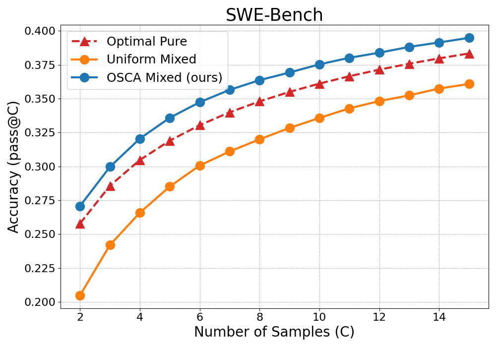
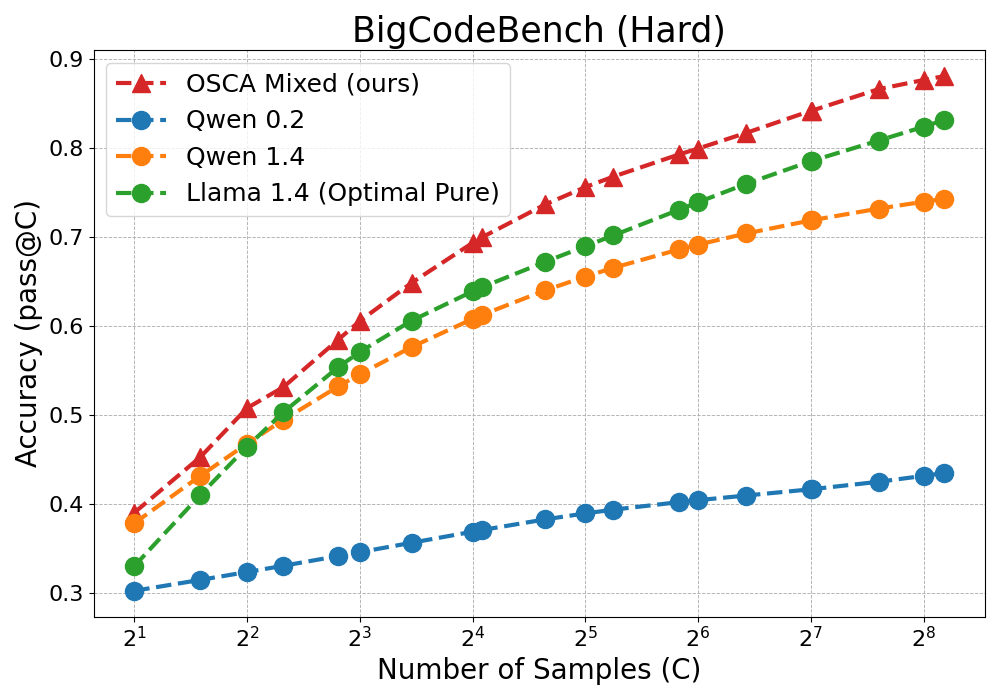

# Scaling LLM Inference with Optimized Sample Compute Allocation

### Install dependencies

```
pip install numpy==2.1.3
pip install tqdm
pip install matplotlib
```

### Run OSCA on SWE-Bench Results

```
python osca.py swebench_agentless.json --ks 1,2,3,4,5,6,7,8,9,10,11,12,13,14,15,16
```

See `eval_swe.ipynb` for details.
You should be able to get a plot like this:



### Run OSCA on BigCodeBench Results

```
python osca.py bcb_results.json --ks 2,3,4,5,7,8,11,16,17,25,32,38,57,64,86,128,129,194,256,291
```

See `bcb.ipynb` for details.
You should be able to get a plot like this:



### To be released

- [ ] The generated solutions from repeated sampling experiments.
- [ ] The code for generating solutions on LiveCodeBench and evaluating it (especially in C++).